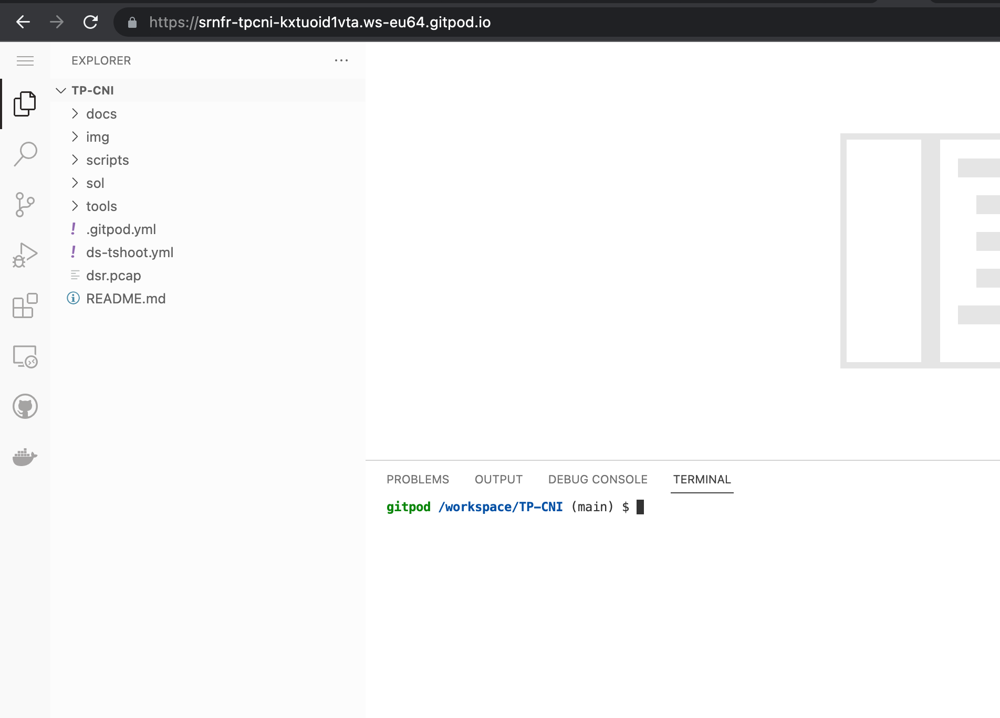
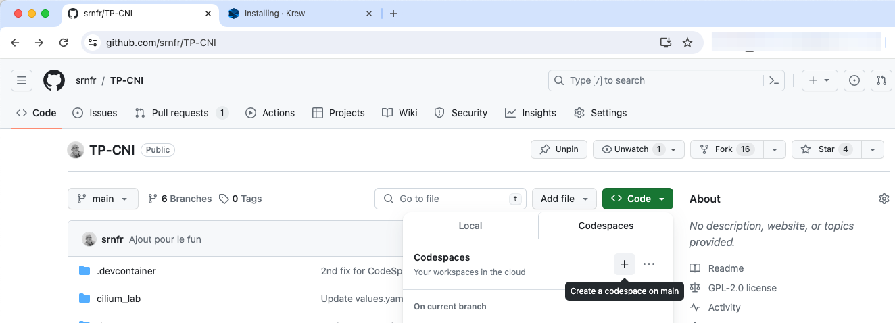
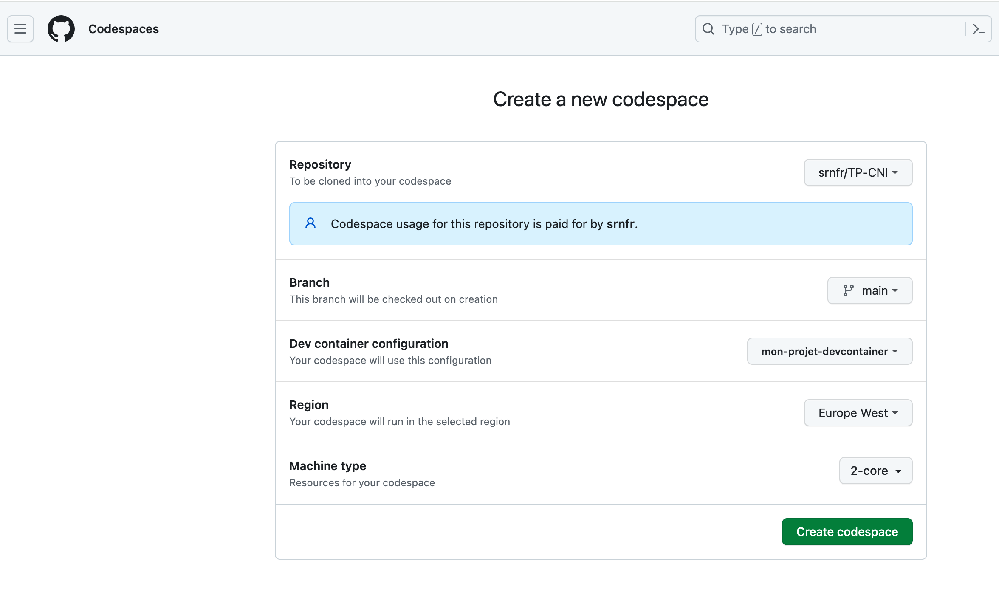
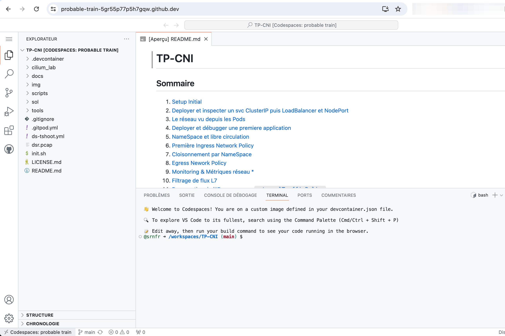
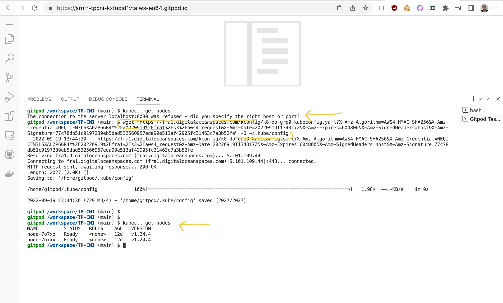

# Setup initial

Ce TP se déroule sur un cluster <ins>**DigitalOcean**<ins>([lien sponsorisé : 200€ sur 60j](https://m.do.co/c/ffe6205525bf)).

## Sommaire
  * [But de l'exercice](#but-du-tp)
  * [Créer un compte GitHub](#créer-un-compte-github)
  * [Ouvrir un workspace dans GitPod](#ouvrir-un-workspace-dans-gitpod)
  * [Verifier `kubectl`](#vérifier-kubectl)
  * [Installer `cilium-cli`](#installer-cilium-cli)
  * [Installer le kubeconfig](#installer-le-kubeconfig)
  * [Vérifier que l'accès `kubectl` fonctionne](#vérifier-que-laccès-kubectl-fonctionne)
  * [Accès aux Nodes](#accès-aux-nodes)
  * [Statut de Cilium CNI](#statut-de-cilium-cni-dans-le-cluster)
  * [Installer `stern` ](#installer-stern-sur-linux)

## But du TP
* Se familiariser et installer les outils nécessaires.
* Valider la configuration d'accès au cluster kubernetes individuel. 

## Créer un compte GitHub

[Github](https://github.com) fait office de SSO pour tout l'ecosysteme Cloud Native.  
Creez ou utilisez votre compte, pour vous connecter dans Github.

Maintenant que vous disposez d'un compte Github, il nous faut un environnement de travail, qui permet l'édition de fichiers et l'execution de commande. Pour cela nous allons utiliser un Cloud IDE , c'est à dire un environnement de developpement (c-a-d soit une VM soit un container sous-javent) accessible via notre navigateur.

Nous présentons ici 2 choix : soit `GitPod` soit `Github CodeSpaces`.
Un seul des choix est à suivre.

  
## Ouvrir un workspace dans GitPod [choix 1]

[Gitpod](https://gitpod.io) est un IDE en ligne qui permet de travailler sur des projets sans avoir à installer quoi que ce soit sur son poste.

Une fois votre compte Github obtenu, vous pouvez vous connecter à Gitpod avec votre compte Github.
Dans le plan OpenSource (Free), vous aurez accès à 50 heures de travail par mois ce qui suffira pour ce cours, à partir du moment où vous détruisez votre environnement le soir (s'il n'est pas mis en hubernation par Gitpod automatiquement)

Lors de la création de votre workspace GitPod, préciser l'URL suivante (c'est bien sûr celle de notre repo):
https://github.com/srnfr/TP-CNI  
Cette étape est indispensable, notamment car nous précisons dans le gitpod.yaml une image qui contient `kubectl`.

Vous devriez obtenir un environnement de travail comme celui-ci:


Prenez le temps de vous familiariser avec l'interface de Gitpod :  
* éditeur de texte (en haut),
* terminal (en bas),
* arborescence de ficher à gauche, etc.

## Ouvrir un workspace dans Github CodeSpaces [choix 2]

Github a crée un équivalent de `Gitpod` sous le nom de `CodeSpaces`
Pour lancer un espace de travail `CodeSpaces`, il suffit de suivre les étapes indiquées dans les captures d'écran ci-dessous

A l'intérieur du répo https://github.com/srnfr/TP-CNI , sélectionnez la liste déroulante du bouton `Code`


On configure l'espace de travail : 


L'espace de travail est prêt :


Si vous tentez de faire un copier/coller, vous devrez répondre "Oui" à cette invitation :


## Vérifier l'outil `kubectl` 

Maintenant que vous êtes dans votre espace de travail `GitPod` (ou `GitHub CodeSpaces`), vérifions que les outils sont en place.

[kubectl](https://kubernetes.io/docs/tasks/tools/install-kubectl/) est l'outil de ligne de commande pour interagir avec un cluster kubernetes.  
Il est déjà installé dans votre environnement.


```shell
kubectl version
```
 Il est normal d'obtenir une erreur car le lien vers le Cluster n'est pas encore établi.
 
 ## Le plugin manager `krew`

[`Krew`]((https://krew.sigs.k8s.io/docs/user-guide/setup/install/)) est un gestionnaire de plugin qui s'intègre à `kubectl`.

Sur [Gitpod](https://gitpod.com), `krew` est déjà installé.

Sous `GitHub Codespaces`, il est nécessaire de l'installer en copiant/collant les commandes ci-dessous dans le terminal web :
```
 cd "$(mktemp -d)" &&
  OS="$(uname | tr '[:upper:]' '[:lower:]')" &&
  ARCH="$(uname -m | sed -e 's/x86_64/amd64/' -e 's/\(arm\)\(64\)\?.*/\1\2/' -e 's/aarch64$/arm64/')" &&
  KREW="krew-${OS}_${ARCH}" &&
  curl -fsSLO "https://github.com/kubernetes-sigs/krew/releases/latest/download/${KREW}.tar.gz" &&
  tar zxvf "${KREW}.tar.gz" &&
  ./"${KREW}" install krew
  ./"${KREW}" install cilium
  ./"${KREW}" list 
  )
  export PATH="${KREW_ROOT:-$HOME/.krew}/bin:$PATH"
  cd -
```

Vérifiez que tout fonctionne :
```kubectl krew```

on obtient ceci :
```
krew is the kubectl plugin manager.
You can invoke krew through kubectl: "kubectl krew [command]..."
[..]
```

La liste des plugins est disponible [ici](https://krew.sigs.k8s.io/plugins/).

## Installer `cilium-cli`

La partie "serveur" de Cilium sera pré-installée sur votre Cluster.

Pour installer le CLI sur *linux* ou *GitPod*, suivez les instructions suivantes:

```bash
curl -L --remote-name-all "https://github.com/cilium/cilium-cli/releases/download/v0.14.8/cilium-linux-amd64.tar.gz"
```
```bash
sudo tar -C /usr/local/bin -xzvf cilium-linux-amd64.tar.gz
```

Et enfin pour tester :  
```bash
cilium  version
```

```bash
cilium  status
```
Il est normal d'obtenir une erreur car le lien vers le Cluster n'est pas encore établi.
 
## Installer le fichier `kubeconfig`

Il est temps de se connecter à notre cluster perso !


L'animateur vous *fournit* le lien de téléchargement du fichier `kubeconfig` (probablement un GDoc).

Enregistrez-le dans votre répertoire "home" sous le nom `.kube/config` grâce à cette commande :

```bash
wget "<URL>" -O ~/.kube/config
```

PS1 : c'est un grand o (la lettre et non un zero)  
PS2 : N'oubliez pas les  guillemets (ou *double quote* en anglais) autour de l'URL.  

**Alternativement (mieux !!)**, tapez la commande :
```bash
./init.sh <GRP_NUMBER> <ENTROPY>
```
avec bien sûr la bonne valeur pour le `GRP_NUMBER` et l' `ENTROPY` (fournis par l'animateur).

## Vérifier que l'accès `kubectl` fonctionne

```bash
kubectl cluster-info
```

Ce qui doit donner :

```
Kubernetes control plane is running at https://xxxxxxxx
CoreDNS is running at https://xxxxxx/api/v1/namespaces/kube-system/services/kube-dns:dns/proxy
```

Pour note, une *cheat-sheet* des commandes kubectl est disponible [ici](https://kubernetes.io/fr/docs/reference/kubectl/cheatsheet/)

Vérifier que les Workers Nodes sont biens vus :
```bash
kubectl get nodes -o wide
```



Observez :
* leurs IP publiques et privées
* la version du container runtime
* la version du kernel sous-jaçent

Pourquoi ne voit-on pas les Master Nodes ?

## Accès aux Nodes

Installons un plugin pour accéder aux Nodes du cluster.

```bash
kubectl krew index add kvaps https://github.com/kvaps/krew-index
kubectl krew install kvaps/node-shell
```

**Choisir** le nom d'un des Nodes vu précédemment (par ex `node-7o7xd` vu sur l'exemple précédent), et lancer un shell dessus:

```bash
$ kubectl node-shell node-7o7xd 
spawning "nsenter-vsine3" on "node-7o7xd"
If you don't see a command prompt, try pressing enter.
root@node-7o7xd:/#  
```

Sortir de ce pod :
```bash
root@node-7o7xd:/# exit
logout
pod "nsenter-vsine3" deleted
gitpod /workspace/TP-CNI (main) $ 
```

## Statut de Cilium CNI dans le cluster

Dans ce setup (i.e cluster managé chez l'opérateur de cloud DigitalOcean), Cilium est déjà installé comme CNI.

```shell
cilium version
```

```shell
cilium status
```

Lancez un test de connectivité pour vérifier que Cilium fonctionne à 100% :
```shell
cilium connectivity test
```


##  Installer `stern`

L'outil `stern` permet de facilement consulter les logs de plusieurs pods en même temps.
Le code est disponible sous [https://github.com/stern/stern](https://github.com/stern/stern).
Il est possible d'obtenir le même résultat en jonglant avec des kubectl `logs`

Pour l'installer :
  
  ```bash
kubectl krew install stern
```

Vérifions qu'il fonctionne :
```bash
kubectl stern -n kube-system cilium
```


---

[Revenir au sommaire](../README.md) | [TP Suivant](./TP02.md)
