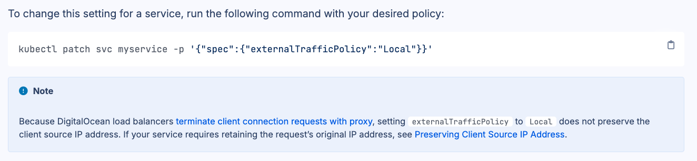

# Préservons l'adresse IP source avec `externalTrafficPolicy`

Ce TP se déroule sur un cluster **DigitalOcean Kubernetes (DOKS)**.

## Sommaire

* [But du TP](#but-du-tp)
* [Déployons l'application Guestbook](#déployons-lapplication-guestbook)
* [Depuis l'intérieur du cluster](#depuis-lintérieur-du-cluster)
* [Depuis l'extérieur](#depuis-lextérieur)
* [Modifions `externalTrafficPolicy`](#modifions-externaltrafficpolicy)
* [Nettoyons](#nettoyons)

## But du TP

Comprenons comment l'adresse IP source d'une connexion externe peut être modifiée par une opération de SNAT avant d'atteindre un Pod serveur.

Observons comment `externalTrafficPolicy` modifie ce comportement.

## Déployons l'application Guestbook

Réutilisons l'application Guestbook déployée au [TP04](./TP04.md).

Depuis DOKS `1.33.1-do.0`, le type de Load Balancer utilisé par défaut est `REGIONAL_NETWORK`. Pour retrouver le comportement historique de ce TP, modifions `frontend-service.yaml` et ajoutons l'annotation suivante dans la section `metadata` du Service :

```yaml
metadata:
  name: frontend
  annotations:
    service.beta.kubernetes.io/do-loadbalancer-type: "REGIONAL"
```

Déployons ensuite l'application et son Service :

```shell
kubectl apply -f frontend-deployment.yaml
kubectl apply -f frontend-service.yaml
```

Vérifions le type demandé au contrôleur cloud DigitalOcean :

```shell
kubectl get service frontend \
    -o jsonpath='{.metadata.annotations.service\.beta\.kubernetes\.io/do-loadbalancer-type}{"\n"}'
```

La commande précédente doit afficher :

```text
REGIONAL
```

Réduisons le Deployment `frontend` à un seul réplica pour simplifier les observations :

```shell
kubectl scale deployment frontend --replicas=1
```

## Depuis l'intérieur du cluster

Dans une première fenêtre de terminal, suivons les logs de l'application pour identifier l'adresse IP source. Remplaçons `frontend-xxxx` par le nom réel du Pod :

```shell
kubectl logs -f frontend-xxxx
```

Dans une seconde fenêtre de terminal, utilisons le Pod `debug-blue`, créé au [TP05](./TP05.md), pour tester avec `curl` l'accès au Service `frontend`. À nous de construire la commande appropriée.

Dans la fenêtre qui affiche les logs, nous devons obtenir des lignes semblables à celles-ci :

```text
10.180.1.10 - - [25/Aug/2026:03:59:32 +0000] "GET / HTTP/1.1" 200 1172 "-" "curl/8.14.1"
10.180.1.10 - - [25/Aug/2026:03:59:34 +0000] "GET / HTTP/1.1" 200 1172 "-" "curl/8.14.1"
```

Vérifions que cette adresse correspond à celle du Pod `debug-blue` et que l'adresse IP source est donc conservée à l'intérieur du cluster.

## Depuis l'extérieur

Depuis notre PC ou notre Codespace, consultons plusieurs fois le site en utilisant l'adresse IP externe du Service `frontend`.

Dans les logs du frontend, constatons que l'adresse IP source peut changer :

```text
10.170.0.4 - - [25/Aug/2026:03:59:32 +0000] "GET / HTTP/1.1" 200 1172 "-" "curl/8.14.1"
10.170.0.5 - - [25/Aug/2026:03:59:33 +0000] "GET / HTTP/1.1" 200 1172 "-" "curl/8.14.1"
10.170.0.4 - - [25/Aug/2026:03:59:34 +0000] "GET / HTTP/1.1" 200 1172 "-" "curl/8.14.1"
```

Avec `externalTrafficPolicy: Cluster`, le Node choisi par le Load Balancer peut transférer la requête vers un Pod situé sur un autre Node. Cette étape peut appliquer une SNAT, ce qui explique que le Pod observe différentes adresses IP privées de Nodes.

## Modifions `externalTrafficPolicy`

Définissons `externalTrafficPolicy` à `Local`, au lieu de la valeur par défaut `Cluster` :

```shell
kubectl patch service frontend -p '{"spec":{"externalTrafficPolicy":"Local"}}'
```

Consultons de nouveau le site depuis l'extérieur et constatons que l'adresse IP source est maintenant stable. Une brève interruption peut se produire pendant la convergence des health checks du Load Balancer.

> [!NOTE]
> Dans la configuration de ce TP, le Load Balancer `REGIONAL` ne transmet pas directement l'adresse IP source du client au Node. Lorsque `externalTrafficPolicy` vaut `Local`, le Pod voit une adresse IP privée stable appartenant au Load Balancer. Cette politique évite toutefois le transfert de la requête vers un Pod situé sur un autre Node. La [documentation DigitalOcean](https://docs.digitalocean.com/products/kubernetes/how-to/configure-load-balancers/#preserving-client-source-ip-address) décrit les mécanismes disponibles pour préserver l'adresse du client.
>
> 

Dans la description du Service `frontend`, déterminons le port TCP `HealthCheck NodePort`. Ce port indique si un Node possède au moins un endpoint local pour ce Service.

Depuis un Codespace, puisque notre PC est probablement filtré, interrogeons ce port sur les différentes adresses IP publiques des Nodes.

Sur un Node qui n'héberge aucun Pod `frontend`, la commande suivante renvoie le statut HTTP `503` et `localEndpoints: 0` :

```shell
curl <NODE1_PUBLIC_IP>:<HEALTHCHECK_PORT>
```

```json
{
  "service": {
    "namespace": "default",
    "name": "frontend"
  },
  "localEndpoints": 0
}
```

Sur le Node qui héberge le Pod, la commande suivante renvoie le statut HTTP `200` et `localEndpoints: 1` :

```shell
curl <NODE2_PUBLIC_IP>:<HEALTHCHECK_PORT>
```

```json
{
  "service": {
    "namespace": "default",
    "name": "frontend"
  },
  "localEndpoints": 1
}
```

Vérifions que l'unique Pod `frontend` se trouve bien sur le Node identifié par le health check.

Augmentons ensuite le nombre de réplicas du `frontend` à trois :

```shell
kubectl scale deployment frontend --replicas=3
```

Dans un cluster à deux Nodes, le scheduler peut placer deux Pods sur un Node et le troisième sur l'autre. La répartition des requêtes peut alors approcher 2/3 sur le premier Node et 1/3 sur le second, tandis que l'adresse IP source observée reste stable.

## Nettoyons

Supprimons le Deployment et le Service :

```shell
kubectl delete deployment/frontend
kubectl delete service/frontend
```

---

[Revenir au sommaire](../README.md) | [TP Suivant](./TP12.md)
