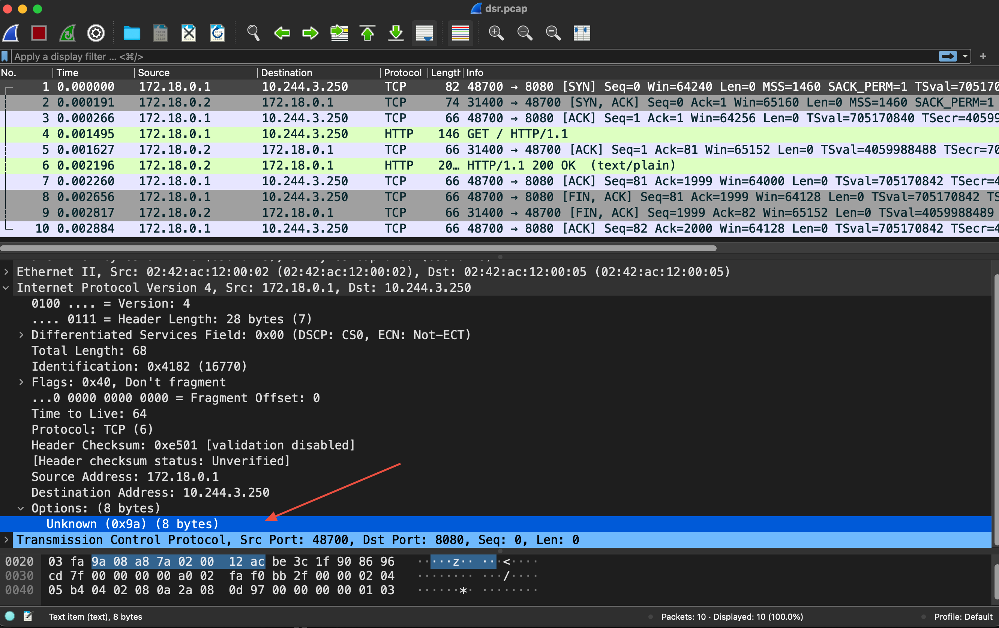
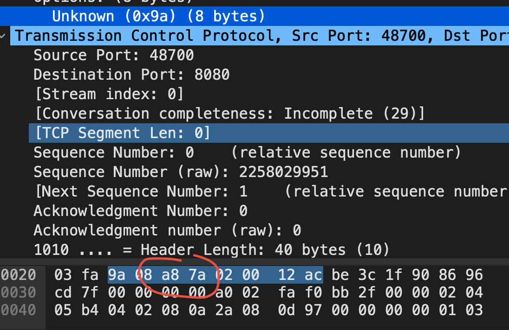
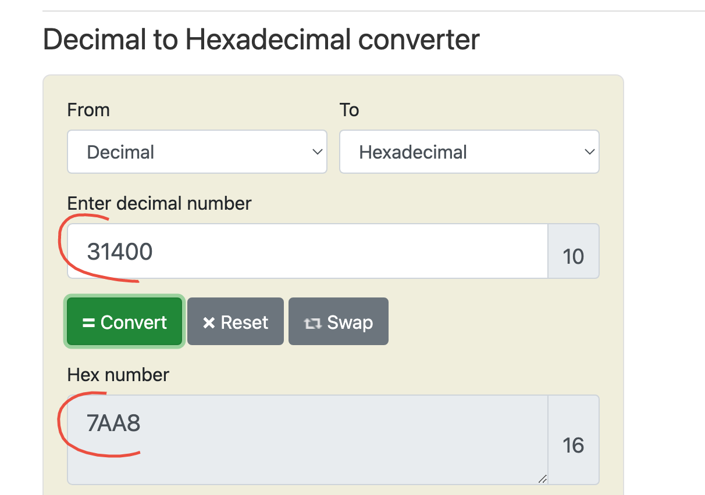

# eBPF & Direct Server Return (DSR)

Ce TP se déroule sur un cluster <ins>**KinD**<ins>.  


## Sommaire
  * [But du TP](#but-du-tp)
  * [Création du Cluster KinD](#creation-du-cluster-kind)
  * [Déploiement d'une app](#deploiement-dune-app)
  * [Analyse de la config réseau](#analyse-de-la-config-reseau)
  * [Mise en évidence de DSR](#mise-en-evidence-de-dsr)
  * [Cleanup](#cleanup)

## But du TP
Dans un environnement réseau plus laxiste que le Cloud public, activer et analyser en détail le DSR lors q'un accès NodePort.

## Création du Cluster KinD

L'animateur vous donne accès à un VM en SSH sur laquelle KinD est installé.

Nettoyons les eventuels clusters déjà présents :
```shell
cd /home/cilium_lab/basic
./clean-kind.sh 
```

Lançons un cluster *sans* CNI :
```shell
./01-install-cluster.sh
```

Sans CNI, on constat que les Nods sont construits mais NotReady :
```shell
kubectl get nodes -o wide
```
Notez l'adresse IP des Nodes (le Master et les Workers).  


Analyser les valeurs présentes dans `ebpf-values.yaml` et installer le CNI :
```shell
helm upgrade --install --namespace kube-system --repo https://helm.cilium.io cilium cilium --version 1.12.2 --values ebpf-values.yaml
```

Pour note, le document de référence des values du chart est [ici](https://github.com/cilium/cilium/tree/v1.12.2/install/kubernetes/cilium).

Attendons que cilium soit prêt :
```shell
cilium status
```

```
    /¯¯\
 /¯¯\__/¯¯\    Cilium:         OK
 \__/¯¯\__/    Operator:       OK
 /¯¯\__/¯¯\    Hubble:         OK
 \__/¯¯\__/    ClusterMesh:    disabled
    \__/

Deployment        hubble-ui          Desired: 1, Ready: 1/1, Available: 1/1
Deployment        cilium-operator    Desired: 2, Ready: 2/2, Available: 2/2
Deployment        hubble-relay       Desired: 1, Ready: 1/1, Available: 1/1
DaemonSet         cilium             Desired: 4, Ready: 4/4, Available: 4/4
Containers:       cilium             Running: 4
                  hubble-ui          Running: 1
                  cilium-operator    Running: 2
                  hubble-relay       Running: 1
Cluster Pods:     5/5 managed by Cilium
Image versions    cilium             quay.io/cilium/cilium:v1.12.2@sha256:986f8b04cfdb35cf714701e58e35da0ee63da2b8a048ab596ccb49de58d5ba36: 4
                  hubble-ui          quay.io/cilium/hubble-ui:v0.9.2@sha256:d3596efc94a41c6b772b9afe6fe47c17417658956e04c3e2a28d293f2670663e: 1
                  hubble-ui          quay.io/cilium/hubble-ui-backend:v0.9.2@sha256:a3ac4d5b87889c9f7cc6323e86d3126b0d382933bd64f44382a92778b0cde5d7: 1
                  cilium-operator    quay.io/cilium/operator-generic:v1.12.2@sha256:00508f78dae5412161fa40ee30069c2802aef20f7bdd20e91423103ba8c0df6e: 2
                  hubble-relay       quay.io/cilium/hubble-relay:v1.12.2@sha256:6f3496c28f23542f2645d614c0a9e79e3b0ae2732080da794db41c33e4379e5c: 1
```

## Déploiement d'une app

Deployons un webserver et son svc en NodePort :
```bash
kubectl apply -f webserver.yml
```

Voyons le svc :
```bash
# kubectl get svc
NAME             TYPE        CLUSTER-IP     EXTERNAL-IP   PORT(S)        AGE
svc-echoserver   NodePort    10.96.88.153   <none>        80:31400/TCP   2m29s
```

Dans mon cas, l'appli est publiée en NodePort sur le port TCP/31400.
Lancer des requetes sur chacun des Nodes sur le NodePort (bien sûr à adaper à votre contexte) :

```bash
for i in {2..5} ; do curl -s http://172.18.0.$i:31400 | grep Requesting ; done
```
Vous noterez que la page web rendue montre que l'IP de l'appellant vu au niveau du serveur est bien celle originale.
Cette preservation est possible grâce à eBPF.

## Analyse de la config réseau

Listons les @Mac de Nodes (en 172.18.0.x)
```bash
arp -an
```

On liste le switch Linux (`brctl show`) et les @macs vue par interface (`brctl showmacs <nom_du_switch>`).
On obtient ainsi le nom des veth associées à chaque Node (dans mon cas Node 2 <=> vethff61702)

## Mise en évidence de DSR

Si depuis ma VM (02:42:1f:d6:b7:3b/172.18.0.1) on cible un Node tiers (ex 172.18.0.2:31400), on constate que c'est l'@Mac du Node (02:42:ac:12:00:05) portant le Pod du svc qui répond 


```bash
# tcpdump -n -e -i vethff61702 "ether host 02:42:ac:12:00:05 and (tcp port 80 or tcp port 8080 or tcp port 31400)"
[..]
22:08:21.848419 02:42:ac:12:00:02 > 02:42:ac:12:00:05, ethertype IPv4 (0x0800), length 82: 172.18.0.1.54502 > 10.244.3.250.8080: Flags [S], seq 3765678582, win 64240, options [mss 1460,sackOK,TS val 704183147 ecr 0,nop,wscale 7], length 0  

22:08:21.848616 02:42:ac:12:00:05 > 02:42:1f:d6:b7:3b, ethertype IPv4 (0x0800), length 74: 172.18.0.2.31400 > 172.18.0.1.54502: Flags [S.], seq 1938530772, ack 3765678583, win 65160, options [mss 1460,sackOK,TS val 4059000794 ecr 704183147,nop,wscale 7], length 0  

22:08:21.848681 02:42:ac:12:00:02 > 02:42:ac:12:00:05, ethertype IPv4 (0x0800), length 66: 172.18.0.1.54502 > 10.244.3.250.8080: Flags [.], ack 1938530773, win 502, options [nop,nop,TS val 704183147 ecr 4059000794], length 0  

22:08:21.848981 02:42:ac:12:00:02 > 02:42:ac:12:00:05, ethertype IPv4 (0x0800), length 146: 172.18.0.1.54502 > 10.244.3.250.8080: Flags [P.], seq 0:80, ack 1, win 502, options [nop,nop,TS val 704183147 ecr 4059000794], length 80: HTTP: GET / HTTP/1.1  
```

Notons que dans le 1er paquet le port TCP DST est déjà DNaté.
Le second paquet porte bien le bon port TCP SRC.

Effectuons une nouvelle capture `tcpdump` en affichant le détail des paquets (avec `-vv`).


```bash
# tcpdump -n -X -e -i vethff61702 "ether host 02:42:ac:12:00:05 and (tcp port 80 or tcp port 8080 or tcp port 31400)"
tcpdump: verbose output suppressed, use -v[v]... for full protocol decode
listening on vethff61702, link-type EN10MB (Ethernet), snapshot length 262144 bytes

22:21:31.462426 02:42:ac:12:00:02 > 02:42:ac:12:00:05, ethertype IPv4 (0x0800), length 82: 172.18.0.1.50074 > 10.244.3.250.8080: Flags [S], seq 327033400, win 64240, options [mss 1460,sackOK,TS val 704972761 ecr 0,nop,wscale 7], length 0
	0x0000:  4700 0044 102d 4000 4006 1657 ac12 0001  G..D.-@.@..W....
	0x0010:  0af4 03fa 9a08 a87a 0200 12ac c39a 1f90  .......z........
	0x0020:  137e 2238 0000 0000 a002 faf0 bb2f 0000  .~\"8........./..
	0x0030:  0204 05b4 0402 080a 2a05 07d9 0000 0000  ........*.......
	0x0040:  0103 0307                                ....

22:21:31.462617 02:42:ac:12:00:05 > 02:42:1f:d6:b7:3b, ethertype IPv4 (0x0800), length 74: 172.18.0.2.31400 > 172.18.0.1.50074: Flags [S.], seq 1104396694, ack 327033401, win 65160, options [mss 1460,sackOK,TS val 4059790408 ecr 704972761,nop,wscale 7], length 0
	0x0000:  4500 003c 0000 4000 3e06 e494 ac12 0002  E..<..@.>.......
	0x0010:  ac12 0001 7aa8 c39a 41d3 c196 137e 2239  ....z...A....~\"9
	0x0020:  a012 fe88 5856 0000 0204 05b4 0402 080a  ....XV..........
	0x0030:  f1fb 7c48 2a05 07d9 0103 0307            ..|H*.......
```

L'IP/TCP appelante est encodée ici : `9a08 a87a 0200 12ac`  
  


Le [code](https://github.com/cilium/cilium/blob/ef3fe349249f1429865fdeb7b9cfe14f812eed88/bpf/lib/nodeport.h) qui construit cette valeur est reproduit ci-dessous : 

```golang
#elif DSR_ENCAP_MODE == DSR_ENCAP_NONE
	iph_old = *(__u32 *)ip4;
	ip4->ihl += sizeof(opt) >> 2;
	ip4->tot_len = bpf_htons(tot_len);
	iph_new = *(__u32 *)ip4;

	opt[0] = bpf_htonl(DSR_IPV4_OPT_32 | svc_port);
	opt[1] = bpf_htonl(svc_addr);
```

On reconnait bien là par exemple le port TCP :  

  


## Cleanup

```shell
cd /home/cilium_lab/basic
./clean-kind.sh 
```


[Revenir au sommaire](../README.md) | [TP Suivant](./TP13.md)