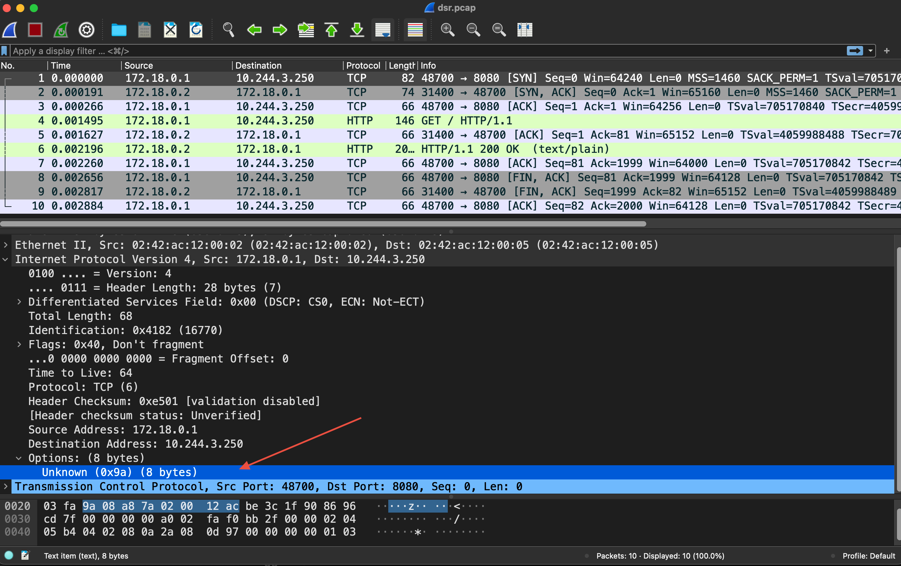
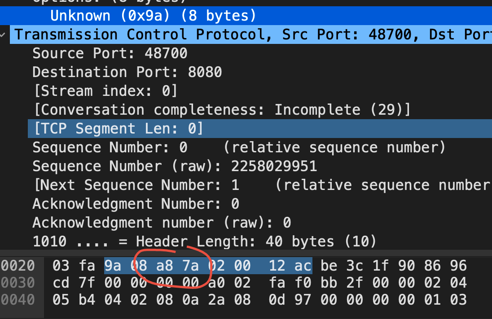
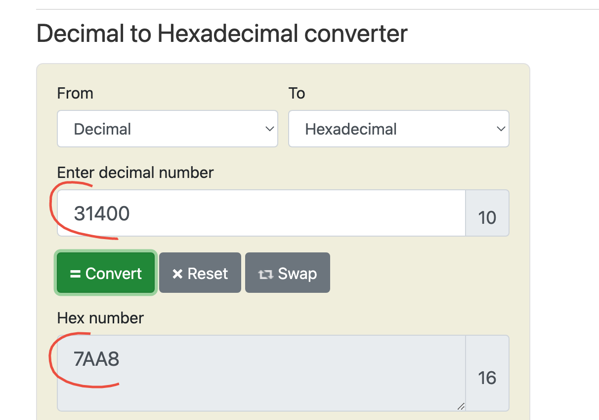

# eBPF & Direct Server Return (DSR)

Ce TP se déroule sur un cluster <ins>**KinD**<ins>.  


## Sommaire
  * [But du TP](#but-du-tp)
  * [Création du Cluster KinD](#creation-du-cluster-kind)
  * [Déploiement d'une app](#deploiement-dune-app)
  * [Analyse de la config réseau](#analyse-de-la-config-reseau)
  * [Mise en évidence de DSR](#mise-en-evidence-de-dsr)
  * [Cleanup](#cleanup)

## But du TP
Dans un environnement réseau plus laxiste que le Cloud public, activer et analyser en détail le DSR lors d'un accès NodePort.

## Création du Cluster KinD

L'animateur vous donne accès à un VM en SSH sur laquelle [KinD](https://kind.sigs.k8s.io/) est installé.

Nettoyons les eventuels clusters déjà présents :
```shell
cd /home/cilium_lab/basic
./clean-kind.sh 
```

Lançons un cluster *sans* CNI :
```shell
./01-install-cluster.sh
```

Sans CNI, on constate que les Nodes sont construits mais `NotReady` :
```shell
kubectl get nodes -o wide
```
Notez l'adresse IP des Nodes (le Master et les Workers), nous en aurons besoin plus bas.

```
NAME                  STATUS   ROLES           AGE     VERSION   INTERNAL-IP   EXTERNAL-IP   OS-IMAGE                         KERNEL-VERSION       CONTAINER-RUNTIME
basic-control-plane   Ready    control-plane   5m34s   v1.35.0   172.18.0.3    <none>        Debian GNU/Linux 12 (bookworm)   5.15.0-119-generic   containerd://2.2.0
basic-worker          Ready    <none>          5m21s   v1.35.0   172.18.0.4    <none>        Debian GNU/Linux 12 (bookworm)   5.15.0-119-generic   containerd://2.2.0
basic-worker2         Ready    <none>          5m21s   v1.35.0   172.18.0.5    <none>        Debian GNU/Linux 12 (bookworm)   5.15.0-119-generic   containerd://2.2.0
basic-worker3         Ready    <none>          5m21s   v1.35.0   172.18.0.2    <none>        Debian GNU/Linux 12 (bookworm)   5.15.0-119-generic   containerd://2.2.0  
```

Analyser les valeurs présentes dans [`ebpf-values.yaml`](/sol/ebpf-values.yaml) et installer le CNI :
```shell
helm upgrade --install --namespace kube-system --repo https://helm.cilium.io cilium cilium --version 1.19.3 --values ebpf-values.yaml
```

Pour note, le document de référence des values du Chart Helm est [ici](https://github.com/cilium/cilium/tree/v1.19.3/install/kubernetes/cilium).

Attendons que cilium soit prêt :
```shell
cilium status
```

```
    /¯¯\
 /¯¯\__/¯¯\    Cilium:             OK
 \__/¯¯\__/    Operator:           OK
 /¯¯\__/¯¯\    Envoy DaemonSet:    OK
 \__/¯¯\__/    Hubble Relay:       OK
    \__/       ClusterMesh:        disabled

DaemonSet              cilium                   Desired: 4, Ready: 4/4, Available: 4/4
DaemonSet              cilium-envoy             Desired: 4, Ready: 4/4, Available: 4/4
Deployment             cilium-operator          Desired: 2, Ready: 2/2, Available: 2/2
Deployment             hubble-relay             Desired: 1, Ready: 1/1, Available: 1/1
Deployment             hubble-ui                Desired: 1, Ready: 1/1, Available: 1/1
Containers:            cilium                   Running: 4
                       cilium-envoy             Running: 4
                       cilium-operator          Running: 2
                       clustermesh-apiserver    
                       hubble-relay             Running: 1
                       hubble-ui                Running: 1
Cluster Pods:          5/5 managed by Cilium
Helm chart version:    1.19.3
Image versions         cilium             quay.io/cilium/cilium:v1.19.3@sha256:2e61680593cddca8b6c055f6d4c849d87a26a1c91c7e3b8b56c7fb76ab7b7b10: 4
                       cilium-envoy       quay.io/cilium/cilium-envoy:v1.36.6-1776000132-2437d2edeaf4d9b56ef279bd0d71127440c067aa@sha256:ba0ab8adac082d50d525fd2c5ba096c8facea3a471561b7c61c7a5b9c2e0de0d: 4
                       cilium-operator    quay.io/cilium/operator-generic:v1.19.3@sha256:205b09b0ed6accbf9fe688d312a9f0fcfc6a316fc081c23fbffb472af5dd62cd: 2
                       hubble-relay       quay.io/cilium/hubble-relay:v1.19.3@sha256:5ee21d57b6ef2aa6db67e603a735fdceb162454b352b7335b651456e308f681b: 1
                       hubble-ui          quay.io/cilium/hubble-ui-backend:v0.13.3@sha256:db1454e45dc39ca41fbf7cad31eec95d99e5b9949c39daaad0fa81ef29d56953: 1
                       hubble-ui          quay.io/cilium/hubble-ui:v0.13.3@sha256:661d5de7050182d495c6497ff0b007a7a1e379648e60830dd68c4d78ae21761d: 1
```

## Déploiement d'une app

Déployons un webserver et son svc en NodePort :
```bash
kubectl apply -f webserver.yml
```

Voyons le svc :
```bash
# kubectl get svc
NAME             TYPE        CLUSTER-IP     EXTERNAL-IP   PORT(S)        AGE
svc-echoserver   NodePort    10.96.88.153   <none>        80:31400/TCP   2m29s
```

Dans mon cas, l'appli est publiée en NodePort sur le port TCP/31400.  

Commencez par consulter la page web en passant sur le NodePort d'une des adresses IP :

```bash
# curl -s http://172.18.0.2:31400
Welcome to echo-server!  Here's what I know.
  > Head to /ws for interactive websocket echo!

-> My hostname is: echoserver-76475c978-sgfz9

-> Requesting IP: 172.18.0.1:60814

-> Request Headers | 

  HTTP/1.1 GET /

  Host: 172.18.0.2:32343
  Accept: */*
  User-Agent: curl/7.81.0
```

Lancez maintenant des requetes sur chacun des Nodes sur le NodePort (bien sûr à <ins>**adapter**</ins> à votre contexte) :

```bash
for i in {2..5} ; do curl -s http://172.18.0.$i:31400 | grep Requesting ; done
```
Vous noterez que la page web rendue montre que l'IP de l'appellant vue au niveau du serveur est bien celle originale.
Cette preservation est possible grâce à eBPF.

## Analyse de la config réseau, détermination de la `veth` à sniffer

Depuis la VM, listons les @Mac de Nodes (en 172.18.0.x)
```bash
arp -an
```
Ce qui donne :
```
? (172.18.0.4) at 02:42:ac:12:00:04 [ether] on br-db3e7f685321
? (172.18.0.3) at 02:42:ac:12:00:03 [ether] on br-db3e7f685321
? (172.18.0.2) at 02:42:ac:12:00:02 [ether] on br-db3e7f685321
? (172.18.0.5) at 02:42:ac:12:00:05 [ether] on br-db3e7f685321
```

On liste le switch Linux (`brctl show` ou `ip link show type bridge`) et les @macs vue par interface (`brctl showmacs <nom_du_switch>` ou `bridge fdb show br <bridge>`).
```
# brctl show
bridge name     bridge id               STP enabled     interfaces
br-db3e7f685321         8000.02428e97953f       no              vethc7b4acb
                                                        vethdc425df
                                                        vethe56ddc0
                                                        vethfc9752c
docker0         8000.0242b701418b       no
```
## Mise en évidence de DSR

Si depuis la VM (02:42:1f:d6:b7:3b/172.18.0.1) on lance un `curl` vers un Node tiers (ex 172.18.0.2:31400), on constate que c'est l'@Mac du Node (02:42:ac:12:00:05) portant l'unique Pod du Service qui répond 


```bash
# tcpdump -n -e -i br-db3e7f685321 "ether host 02:42:ac:12:00:05 and tcp port 31400"
[..]
22:08:21.848419 02:42:ac:12:00:02 > 02:42:ac:12:00:05, ethertype IPv4 (0x0800), length 82: 172.18.0.1.54502 > 10.244.3.250.8080: Flags [S], seq 3765678582, win 64240, options [mss 1460,sackOK,TS val 704183147 ecr 0,nop,wscale 7], length 0  

22:08:21.848616 02:42:ac:12:00:05 > 02:42:1f:d6:b7:3b, ethertype IPv4 (0x0800), length 74: 172.18.0.2.31400 > 172.18.0.1.54502: Flags [S.], seq 1938530772, ack 3765678583, win 65160, options [mss 1460,sackOK,TS val 4059000794 ecr 704183147,nop,wscale 7], length 0  

22:08:21.848681 02:42:ac:12:00:02 > 02:42:ac:12:00:05, ethertype IPv4 (0x0800), length 66: 172.18.0.1.54502 > 10.244.3.250.8080: Flags [.], ack 1938530773, win 502, options [nop,nop,TS val 704183147 ecr 4059000794], length 0  

22:08:21.848981 02:42:ac:12:00:02 > 02:42:ac:12:00:05, ethertype IPv4 (0x0800), length 146: 172.18.0.1.54502 > 10.244.3.250.8080: Flags [P.], seq 0:80, ack 1, win 502, options [nop,nop,TS val 704183147 ecr 4059000794], length 80: HTTP: GET / HTTP/1.1  
```

Notons que dans le 1er paquet le port TCP DST est déjà DNaté.
Le second paquet porte bien le bon port TCP SRC.

Effectuons une nouvelle capture `tcpdump` en affichant le détail des paquets (avec `-vv`).


```bash
# tcpdump -n -X -e -i vethff61702 "ether host 02:42:ac:12:00:05 and (tcp port 80 or tcp port 8080 or tcp port 31400)"
tcpdump: verbose output suppressed, use -v[v]... for full protocol decode
listening on vethff61702, link-type EN10MB (Ethernet), snapshot length 262144 bytes

22:21:31.462426 02:42:ac:12:00:02 > 02:42:ac:12:00:05, ethertype IPv4 (0x0800), length 82: 172.18.0.1.50074 > 10.244.3.250.8080: Flags [S], seq 327033400, win 64240, options [mss 1460,sackOK,TS val 704972761 ecr 0,nop,wscale 7], length 0
	0x0000:  4700 0044 102d 4000 4006 1657 ac12 0001  G..D.-@.@..W....
	0x0010:  0af4 03fa 9a08 a87a 0200 12ac c39a 1f90  .......z........
	0x0020:  137e 2238 0000 0000 a002 faf0 bb2f 0000  .~\"8........./..
	0x0030:  0204 05b4 0402 080a 2a05 07d9 0000 0000  ........*.......
	0x0040:  0103 0307                                ....

22:21:31.462617 02:42:ac:12:00:05 > 02:42:1f:d6:b7:3b, ethertype IPv4 (0x0800), length 74: 172.18.0.2.31400 > 172.18.0.1.50074: Flags [S.], seq 1104396694, ack 327033401, win 65160, options [mss 1460,sackOK,TS val 4059790408 ecr 704972761,nop,wscale 7], length 0
	0x0000:  4500 003c 0000 4000 3e06 e494 ac12 0002  E..<..@.>.......
	0x0010:  ac12 0001 7aa8 c39a 41d3 c196 137e 2239  ....z...A....~\"9
	0x0020:  a012 fe88 5856 0000 0204 05b4 0402 080a  ....XV..........
	0x0030:  f1fb 7c48 2a05 07d9 0103 0307            ..|H*.......
```

L'IP/TCP appelante est encodée ici : `9a08 a87a 0200 12ac`  
  


Le [code](https://github.com/cilium/cilium/blob/v1.19.3/bpf/lib/nodeport.h) qui construit cette valeur est reproduit ci-dessous : 

```golang
#elif DSR_ENCAP_MODE == DSR_ENCAP_NONE
	iph_old = *(__u32 *)ip4;
	ip4->ihl += sizeof(opt) >> 2;
	ip4->tot_len = bpf_htons(tot_len);
	iph_new = *(__u32 *)ip4;

	opt[0] = bpf_htonl(DSR_IPV4_OPT_32 | svc_port);
	opt[1] = bpf_htonl(svc_addr);
```

On reconnait bien là par exemple le port TCP :  

  


## Cleanup

```shell
cd /home/cilium_lab/basic
./clean-kind.sh 
```


[Revenir au sommaire](../README.md) | [TP Suivant](./TP13.md)
