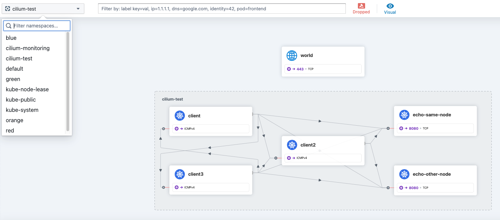

# Hubble

Ce TP se déroule sur un cluster <ins>**KinD**<ins> (bien que DigitalOcean le supporte maintenant). 

## Sommaire
  * [But du TP](#but-du-tp)
  * [Pre-requis](#pre-requis)
  * [Hubble CLI](#hubble-cli)
  * [Hubble UI](#hubble-ui)
  * [Hubble observe sur un Node](#hubble-observe-sur-un-node)
  * [Hubble Relay](#hubble-relay)
  * [Jouez !](#jouez-)
  * [Cleanup](#cleanup)

## But du TP
Savoir installer, accéder et utiliser Hubble en UI et en CLI 

## Pre-requis

NB: Si vous souhaitez utiliser votre *cluster DigitalOcean*, Hubble est déjà activé, passez directement à [l'étape suivante](https://github.com/srnfr/TP-CNI/blob/main/docs/TP14.md#hubble-ui).

*Sur la VM* dont les accès vous ont été fournis par l'animateur :

Nettoyons les eventuels clusters déjà présents :
```shell
cd /home/cilium_lab/basic
./clean-kind.sh 
```

Lançons un cluster *sans* CNI :
```shell
./01-install-cluster.sh
```

Installons le CNI
```shell
helm upgrade --install --namespace kube-system --repo https://helm.cilium.io cilium cilium --version 1.15.1 --values ebpf-values-nokubeproxy.yaml
```

## Hubble CLI

A l'instar de `cilium`, il existe un CLI pour `hubble` ([lien](https://docs.cilium.io/en/stable/gettingstarted/hubble_setup/#install-the-hubble-client)), mais il est **déjà installé** sur votre VM ou votre GitPod/CodeSpaces :

```shell
# hubble version
hubble 0.13.0 compiled with go1.21.6 on linux/amd64
```

Au bout de plusieurs minutes, vérifier que Cilium est ok :
```shell
cilium status
```
Lancer les tests de connectivité :
```shell
cilium connectivity  test
```

Huble ne peut être installé en même temps en CLI et en Helm.
Si on fait en Helm, il faut s'assurer que le paragraphe est présent dans le fichier ebpf-values.yaml précisé dans la commande Helm:
```yaml
hubble:
  enabled: true
  relay:
    enabled: true
  ui:
    enabled: true
```

## Hubble UI

On lance ensuite Hubble UI :
```bash
cilium hubble ui &
```

L'UI écoute sur le port TCP/12000 :
```
# ℹ️  Opening "http://localhost:12000" in your browser...
```

Reperez l'@IP publique de la VM :
```shell
# ifconfig eth0
eth0: flags=4163<UP,BROADCAST,RUNNING,MULTICAST>  mtu 1500
        inet **46.101.186.zzz**  netmask 255.255.192.0  broadcast 46.101.191.255
        inet6 fe80::47a:17ff:fea2:b9e9  prefixlen 64  scopeid 0x20<link>
        ether 06:7a:17:a2:b9:e9  txqueuelen 1000  (Ethernet)
        RX packets 85068  bytes 1689421494 (1.6 GB)
        RX errors 0  dropped 0  overruns 0  frame 0
        TX packets 31382  bytes 5277651 (5.2 MB)
        TX errors 0  dropped 0 overruns 0  carrier 0  collisions 0
```

Connectez-vous sur http://46.101.186.zzz:12001 (un nginx local à la VM et pré-installé par nos soins *reverse-proxyfie* 12001 vers localhost:12000)

Pour voir du traffic, lancez un `cilium connectivity test` et observez le ns `cilium-test`.
(un bouton en haut à gauche "Any Verdict" permet de sélectionner seulement certain type de trafic)



*PS* : il est plus élégant de faire :
```shell
kubectl port-forward -n kube-system svc/hubble-ui 12000:80
```

## `hubble observe` depuis un Node

On peut obtenir des informations directement en ligne de commande sur un des Pod Cilium :

```shell
kubectl exec -it ds/cilium -n kube-system -c cilium-agent -- hubble observe           
```

Il existe de nombreuses options de filtrage.   
Obtenez en une liste par un `hubble help observe`.

## Hubble Relay

Pour avoir des informations aggrégées de tous les noeuds, il faut s'addresser au Hubble Relay qui collecte les informations de tous les serveurs Hubble embarqués dans les cilium-agent.

```shell
kubectl -n kube-system port-forward service/hubble-relay --address 0.0.0.0 --address :: 4245:80 &
```

Depuis notre VM on peut requeter :
```shell
hubble status
```

On obtient :
```
Handling connection for 4245
Healthcheck (via localhost:4245): Ok
Current/Max Flows: 880/16,380 (5.37%)
Flows/s: 7.04
Connected Nodes: 4/4
```

```shell
# hubble list nodes
Handling connection for 4245
NAME                  STATUS      AGE     FLOWS/S   CURRENT/MAX-FLOWS
basic-control-plane   Connected   2m29s   3.21      510/4095 ( 12.45%)
basic-worker          Connected   2m28s   0.59      106/4095 (  2.59%)
basic-worker2         Connected   2m32s   0.71      134/4095 (  3.27%)
basic-worker3         Connected   2m32s   2.61      428/4095 ( 10.45%)
```

On peut analyser les flux :
```shell
# hubble observe -f
Handling connection for 4245
Sep 14 05:44:59.479: 172.18.0.5:54612 (remote-node) <- 10.244.3.249:4240 (health) to-stack FORWARDED (TCP Flags: ACK)
Sep 14 05:44:59.481: 172.18.0.4:39792 (remote-node) -> 10.244.3.249:4240 (health) to-endpoint FORWARDED (TCP Flags: ACK, PSH)
Sep 14 05:44:59.481: 172.18.0.4:39792 (remote-node) <- 10.244.3.249:4240 (health) to-stack FORWARDED (TCP Flags: ACK)
Sep 14 05:44:59.481: 172.18.0.4 (remote-node) -> 10.244.3.249 (health) to-endpoint FORWARDED (ICMPv4 EchoRequest)
Sep 14 05:44:59.481: 172.18.0.4 (remote-node) <- 10.244.3.249 (health) to-stack FORWARDED (ICMPv4 EchoReply)
```

Vous pouvez ajouter le paramètre `-n default` et/ou `--verdict DROPPED` pour vous restreindre à un namespace.

Pour info, voici une trace d'un pod Good autorisé à se connecter à un redis-master :
```shell
Mar  6 09:26:19.863: default/good:53354 (ID:4753) -> default/redis-leader:6379 (world) to-stack FORWARDED (TCP Flags: SYN)
Mar  6 09:26:19.863: 10.244.1.122:53354 (ID:4753) -> default/redis-leader-6cc46676d8-t4lrb:6379 (ID:1810) policy-verdict:L3-Only INGRESS ALLOWED (TCP Flags: SYN)
Mar  6 09:26:19.863: 10.244.1.122:53354 (ID:4753) -> default/redis-leader-6cc46676d8-t4lrb:6379 (ID:1810) to-endpoint FORWARDED (TCP Flags: SYN)
Mar  6 09:26:19.863: 10.244.1.122:53354 (host) <- default/redis-leader-6cc46676d8-t4lrb:6379 (ID:1810) to-stack FORWARDED (TCP Flags: SYN, ACK)
Mar  6 09:26:19.863: default/good:53354 (ID:4753) <- default/redis-leader:6379 (ID:1810) to-endpoint FORWARDED (TCP Flags: SYN, ACK)
```

Pour avoir plus de détail on ajoute le flag `-o json` à `hubble observe -f` et on obtient par exemple :
```shell
hubble observe -f --pod redis-leader-6cc46676d8-t4lrb -o json
[..]
{"flow":{"time":"2024-03-06T09:47:20.003688495Z","uuid":"02ef2e23-4cbe-4bbc-9466-2c34605cb75a","verdict":"FORWARDED","ethernet":{"source":"02:03:af:cf:27:23","destination":"de:28:f6:43:52:13"},"IP":{"source":"10.244.1.122","destination":"10.244.1.87","ipVersion":"IPv4"},"l4":{"TCP":{"source_port":63044,"destination_port":6379,"flags":{"SYN":true}}},"source":{"identity":4753,"labels":["k8s:app=guestbook","k8s:io.cilium.k8s.namespace.labels.kubernetes.io/metadata.name=default","k8s:io.cilium.k8s.policy.cluster=default","k8s:io.cilium.k8s.policy.serviceaccount=default","k8s:io.kubernetes.pod.namespace=default","k8s:tier=frontend"]},"destination":{"ID":2010,"identity":1810,"namespace":"default","labels":["k8s:app=redis","k8s:io.cilium.k8s.namespace.labels.kubernetes.io/metadata.name=default","k8s:io.cilium.k8s.policy.cluster=default","k8s:io.cilium.k8s.policy.serviceaccount=default","k8s:io.kubernetes.pod.namespace=default","k8s:role=leader","k8s:tier=backend"],"pod_name":"redis-leader-6cc46676d8-t4lrb","workloads":[{"name":"redis-leader","kind":"Deployment"}]},"Type":"L3_L4","node_name":"basic-worker","event_type":{"type":5},"traffic_direction":"INGRESS","policy_match_type":1,"is_reply":false,"Summary":"TCP Flags: SYN","ingress_allowed_by":[{"name":"cnp-allow-from-frontend","namespace":"default","labels":["k8s:io.cilium.k8s.policy.derived-from=CiliumNetworkPolicy","k8s:io.cilium.k8s.policy.name=cnp-allow-from-frontend","k8s:io.cilium.k8s.policy.namespace=default","k8s:io.cilium.k8s.policy.uid=76f3e468-6363-4d68-a0e0-0cff85ee5909"],"revision":"4"}]},"node_name":"basic-worker","time":"2024-03-06T09:47:20.003688495Z"}
```
On peut indexer ces JSON avec des backends classiques (elastic, splunk...) mais également les visualiser avec https://jsonformatter.curiousconcept.com


## Jouez !!

Déployez à nouveau un TP de filtrage précedent et observez les flux bloqués ou ceux qui passent...
Si vous n'avez pas d'idée :

```shell
cilium connectivity test
```

Pour une courte démo de ce que l'on peut faire avec Hubble, vous pouvez regarder cette vidéo [lien](https://www.youtube.com/watch?v=zQr4tEj-a4M)

## Cleanup

Effaçons notre cluster :

```shell
cd /home/cilium_lab/basic
./clean-kind.sh 
```
---


[Revenir au sommaire](../README.md) | [TP Suivant](./TP14.md)
