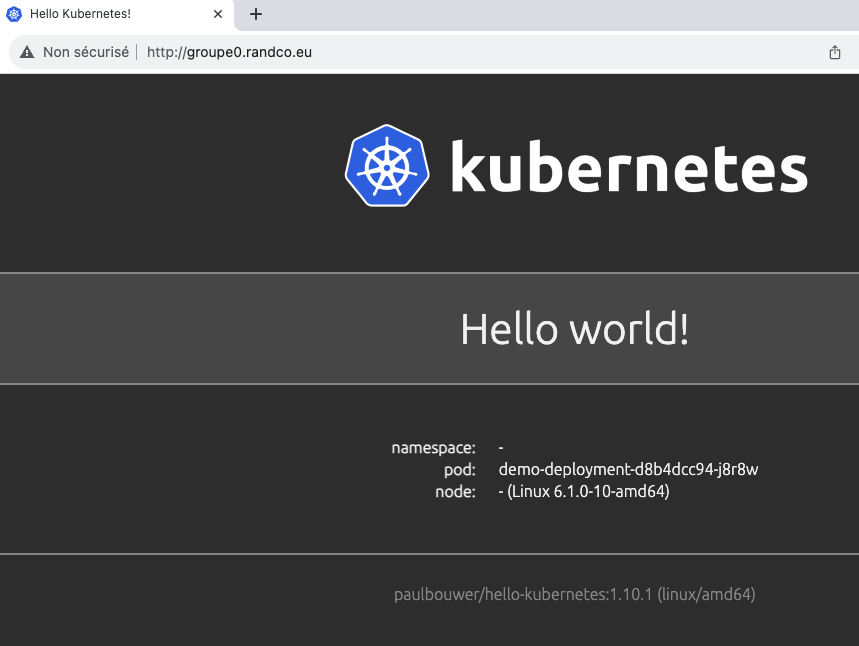

# Ingress Controler

Ce TP se déroule sur un cluster <ins>**DigitalOcean**<ins>.

## Sommaire
  * [But du TP](#but-du-tp)
  * [Helm](#helm)
  * [Deploiement](#deploiement)
  * [HTTPS](#https)


# But du TP
Manipuler l'objet Ingress Controler pour publier en HTTP et HTTPS nos services internes.
Nous utiliserons l'implémentation de NGINX qui fait référence.
Cilium propose depuis récemment [sa propre implémentation](https://docs.cilium.io/en/stable/network/servicemesh/ingress/). 

# Etape 0 : Initialisation du numero de groupe

Positionner une variable qui contient votre numéro de groupe :
```shell
GRP=X
echo $GRP
X
```

!! Bien sûr utiliser la bonne valeur de X

# Etape 1 : Installation d'un Ingress Controler via Helm

Commençons par installer localement le repo `ingress-nginx`
```shell
helm repo add ingress-nginx https://kubernetes.github.io/ingress-nginx
helm repo update
```
Créeons le NameSpace dédié :
```shell
kubectl create namespace ingress-nginx
```

Puis déployons l'Ingress Controller, en précisant des annotations relaitves à DigitalOcean :

```shell
helm install ingress-nginx ingress-nginx/ingress-nginx \
  --namespace ingress-nginx \
  --set controller.publishService.enabled=true \
  --set-string controller.service.annotations."service\.beta\.kubernetes\.io/do-loadbalancer-name"="lb-groupe${GRP}"
  ```

Vous devez obtenir :
```shell
$ kubectl get service ingress-nginx-controller --namespace ingress-nginx
NAME                       TYPE           CLUSTER-IP      EXTERNAL-IP       PORT(S)                      AGE
ingress-nginx-controller   LoadBalancer   10.245.70.241   144.126.246.212   80:30343/TCP,443:31042/TCP   3m47s
```

***NB*** : Un Load-Balancer frontal est toujours nécessaire, sa création est souvent implicite.

# Etape 2 : Deploiement d'une règle Ingress (routage HTTP)

Déployons maintenant notre service de type ClusterIP qui pointe sur un Pod NGINX-DEMO, et la règle d'Ingress
(Attention de bien modifier le nom du host dans le fichier ingress.yaml avec le bon numéro de groupe) :

```shell
sed "s/GRP/$GRP/" sol/ingress.tpl > sol/ingress.yaml
kubectl apply -f sol/ingress.yaml
```
Vérifions :
```shell
$ kubectl get ingress
NAME           CLASS   HOSTS               ADDRESS         PORTS   AGE
demo-ingress   nginx   groupeX.randco.eu   a.b.c.d   80      39s
```

Par ailleurs, assurons que la résolution DNS du site web soit correcte (tâche du formateur):
```bash
ping groupeX.randco.eu
```
Si tout est OK, la consultation du site http://groupeX.randco.eu doit être fonctionnelle :


# Etape 3 : Publcation en HTTPS
Ajoutons un générateur de certificats TLS motorisé par Let'sEncrypt, [Cert-Manager](https://cert-manager.io/):

``` bash
helm repo add jetstack https://charts.jetstack.io

helm repo update

helm install \
  cert-manager jetstack/cert-manager \
  --namespace cert-manager \
  --create-namespace \
  --version v1.12.0 \
  --set installCRDs=true
```

Maintenant, instançions CertManager:

```yaml
## issuer.yml
apiVersion: cert-manager.io/v1
kind: ClusterIssuer
metadata:
  name: letsencrypt-prod
spec:
  acme:
    server: https://acme-v02.api.letsencrypt.org/directory
    email: example@randco.eu
    privateKeySecretRef:
      name: letsencrypt-prod
    solvers:
      - http01:
          ingress:
            ingressClassName: nginx
```

```bash
kubectl apply -f issuer.yml
```

Moditions le fichier ingress.yalml (ne pas oublier de le ré-appliquer) en ajoutant : 
- une annotations relatives au certificat issuer
- en fin de fichier le nom TLS et le secret associé

```yaml
apiVersion: networking.k8s.io/v1
kind: Ingress
metadata:
  name: demo-ingress
  annotations:
    cert-manager.io/cluster-issuer: letsencrypt-prod
spec:
  ingressClassName: nginx
  rules:
    - host: groupeX.randco.eu
      http:
        paths:
          - path: /
            pathType: Prefix
            backend:
              service:
                name: demo-service
                port:
                  number: 80
  tls:
    - hosts:
       - groupeX.randco.eu
       secretName: groupe0.randco.eu-tls
```
Il ne reste plus qu'à visiter https://groupeX.randco.eu

Pour les plus curieux, voici quelques commandes qui permettent d'inspecter les états :

```bash
kubectl get clusterissuer
kubectl get certificate
kubectl get certificaterequests
kubectl get order
kubectl get challenge
```
 

[Revenir au sommaire](../README.md) | [TP Suivant](./TP16.md)
