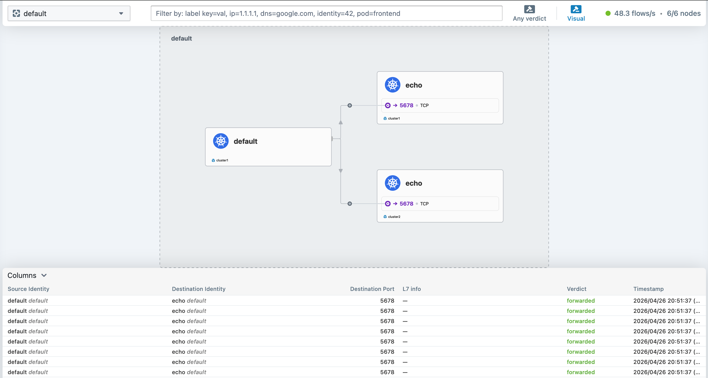

# Cilium Cluster Mesh

Ce TP se déroule sur **deux clusters <ins>KinD</ins>** sur un même serveur Ubuntu.

## Sommaire
  * [But du TP](#but-du-tp)
  * [Etape 0 Préparation](#etape-0-préparation)
  * [Etape 1 Création des clusters KinD](#etape-1-création-des-clusters-kind)
  * [Etape 2 Installation de Cilium](#etape-2-installation-de-cilium)
  * [Etape 3 Activation du Cluster Mesh](#etape-3-activation-du-cluster-mesh)
  * [Etape 4 Vérification de la connectivité](#etape-4-vérification-de-la-connectivité)
  * [Etape 5 Service Global cross-cluster](#etape-5-service-global-cross-cluster)
  * [Etape 6 Démo de failover](#etape-6-démo-de-failover)
  * [Cleanup](#cleanup)

On utilise `cilium` en version **1.19.3** et la fonctionnalité **Cluster Mesh** qui permet de fédérer plusieurs clusters Kubernetes en un plan de contrôle réseau unifié.

## But du TP
* Déployer deux clusters KinD avec des CIDRs distincts sur le même hôte Ubuntu.
* Installer Cilium sur chaque cluster avec un `cluster.name` et un `cluster.id` uniques.
* Connecter les deux clusters via `cilium clustermesh connect`.
* Déployer un **Service Global** accessible et load-balancé depuis les deux clusters.
* Observer le **failover automatique** en cas d'indisponibilité d'un cluster.

## Etape 0 Préparation

Connectez-vous en SSH sur la VM fournie par l'animateur. `KinD`, `kubectl`, `helm` et `cilium` y sont déjà installés.

```shell
cd /home/cilium_lab/clustermesh
```

Nettoyons les éventuels clusters existants :
```shell
./clean-kind.sh
```

## Etape 1 Création des clusters KinD

Nous allons créer **deux clusters KinD distincts** avec des plages d'adresses (Pod CIDR, Service CIDR) qui ne se chevauchent pas. C'est une condition impérative pour que Cluster Mesh fonctionne.

| Cluster | Pod CIDR      | Service CIDR    | API Port |
|---------|---------------|-----------------|----------|
| mesh1   | 10.1.0.0/16   | 10.101.0.0/16   | 6443     |
| mesh2   | 10.2.0.0/16   | 10.102.0.0/16   | 6444     |

Le fichier `kind-config-cluster1.yaml` :
```yaml
kind: Cluster
name: mesh1
apiVersion: kind.x-k8s.io/v1alpha4
nodes:
- role: control-plane
- role: worker
- role: worker
networking:
  apiServerAddress: "0.0.0.0"
  apiServerPort: 6443
  podSubnet: "10.1.0.0/16"
  serviceSubnet: "10.101.0.0/16"
  disableDefaultCNI: true
  kubeProxyMode: none
```

Le fichier `kind-config-cluster2.yaml` est identique avec `name: mesh2`, `apiServerPort: 6444` et les CIDRs `10.2.0.0/16` / `10.102.0.0/16`.

Lançons la création des deux clusters :
```shell
./01-build-clusters.sh
```

Au bout de quelques minutes :
```
--- Noeuds mesh1 ---
NAME                  STATUS     ROLES           AGE   VERSION
mesh1-control-plane   NotReady   control-plane   30s   v1.35.0
mesh1-worker          NotReady   <none>          10s   v1.35.0
mesh1-worker2         NotReady   <none>          10s   v1.35.0
--- Noeuds mesh2 ---
NAME                  STATUS     ROLES           AGE   VERSION
mesh2-control-plane   NotReady   control-plane   30s   v1.35.0
mesh2-worker          NotReady   <none>          10s   v1.35.0
mesh2-worker2         NotReady   <none>          10s   v1.35.0
```

Les noeuds sont en `NotReady` car le CNI n'est pas encore installé. 

KinD crée deux contextes kubectl :

```shell
kubectl config get-contexts
```

```
CURRENT   NAME         CLUSTER      AUTHINFO     NAMESPACE
          kind-mesh1   kind-mesh1   kind-mesh1
*         kind-mesh2   kind-mesh2   kind-mesh2
```

## Etape 2 Installation de Cilium

Chaque cluster reçoit sa propre configuration avec un **identifiant de cluster unique** (`cluster.id`) et un **nom unique** (`cluster.name`). Ces deux paramètres sont obligatoires pour Cluster Mesh.

Dans ce TP, l'installation est faite via `cilium install` et l'activation du Cluster Mesh via `cilium clustermesh enable`. Il faut rester dans ce mode de gestion de bout en bout, sans mélanger avec `helm upgrade --install` pour éviter les conflits de field managers.

Le fichier `values-cluster1.yaml` :
```yaml
cluster:
  name: cluster1
  id: 1

kubeProxyReplacement: true
k8sServiceHost: mesh1-control-plane
k8sServicePort: 6443

routingMode: native
autoDirectNodeRoutes: true
ipv4NativeRoutingCIDR: "10.0.0.0/8"

ipam:
  mode: kubernetes

image:
  pullPolicy: IfNotPresent

hubble:
  enabled: true
  relay:
    enabled: true
  ui:
    enabled: true
```

Le fichier `values-cluster2.yaml` est identique avec `cluster.name: cluster2`, `cluster.id: 2` et `k8sServiceHost: mesh2-control-plane`.

Le script `02-install-cilium.sh` fait ensuite quatre choses :
* installe Cilium sur `mesh1`
* récupère le secret `cilium-ca` de `mesh1` et le copie dans `mesh2`
* installe Cilium sur `mesh2` avec ce CA partagé
* active le `clustermesh-apiserver` sur les deux clusters avec `cilium clustermesh enable --service-type NodePort`

Installons Cilium sur les deux clusters :
```shell
./02-install-cilium.sh
```

En détail, le coeur du script ressemble à ceci :
```bash
cilium install \
  --context kind-mesh1 \
  --version 1.19.3 \
  --values values-cluster1.yaml

kubectl get secret cilium-ca -n kube-system \
  --context kind-mesh1 -o yaml \
  | grep -v '^\s*\(creationTimestamp\|resourceVersion\|uid\|selfLink\|generation\):' \
  | kubectl apply --context kind-mesh2 -f -

cilium install \
  --context kind-mesh2 \
  --version 1.19.3 \
  --values values-cluster2.yaml

cilium clustermesh enable --context kind-mesh1 --service-type NodePort
cilium clustermesh enable --context kind-mesh2 --service-type NodePort
```

> **Note importante** : le partage du `cilium-ca` entre les deux clusters évite les problèmes de certificats lors du `cilium clustermesh connect`.

> **Note sur NodePort** : le warning `Service type NodePort detected! Service may fail when nodes are removed from the cluster!` est attendu dans ce TP. Sur KinD, nous n'avons pas de `LoadBalancer` externe. `NodePort` est donc le mode d'exposition le plus simple et le plus réaliste pour ce lab.

Après quelques minutes, vérifier que les deux clusters sont opérationnels :
```shell
cilium status --context kind-mesh1
cilium status --context kind-mesh2
```
```
    /¯¯\
 /¯¯\__/¯¯\    Cilium:             OK
 \__/¯¯\__/    Operator:           OK
 /¯¯\__/¯¯\    Envoy DaemonSet:    OK
 \__/¯¯\__/    Hubble Relay:       OK
    \__/       ClusterMesh:        OK
```

Vérifier que le pod `clustermesh-apiserver` est bien présent :
```shell
kubectl get pods -n kube-system -l app.kubernetes.io/name=clustermesh-apiserver --context kind-mesh1
kubectl get pods -n kube-system -l app.kubernetes.io/name=clustermesh-apiserver --context kind-mesh2
```
```
NAME                                    READY   STATUS    RESTARTS   AGE
clustermesh-apiserver-xxxxxxxxx-yyyyy   3/3     Running   0          2m
```

## Etape 3 Activation du Cluster Mesh

La connexion entre les deux clusters s'effectue avec une seule commande. Elle extrait automatiquement les certificats TLS et les endpoints du `clustermesh-apiserver` de chaque cluster et crée les Secrets de configuration dans l'autre :

```shell
./03-enable-clustermesh.sh
```

En détail, cette commande exécute :
```bash
cilium clustermesh connect \
  --context kind-mesh1 \
  --destination-context kind-mesh2
```

Une seule commande suffit : la connexion est propagée dans les deux sens.

Vérifions le statut :
```shell
cilium clustermesh status --context kind-mesh1
```
```
✅ Service "clustermesh-apiserver" of type "NodePort" found
✅ Deployment clustermesh-apiserver is ready
ℹ️  KVStoreMesh is enabled

✅ All 3 nodes are connected to all clusters [min:1 / avg:1.0 / max:1]
✅ All 1 KVStoreMesh replicas are connected to all clusters [min:1 / avg:1.0 / max:1]

🔌 Cluster Connections:
  - cluster2: 3/3 configured, 3/3 connected - KVStoreMesh: 1/1 configured, 1/1 connected
```

Les deux clusters se voient mutuellement. La connexion est **bidirectionnelle** : une seule commande `connect` suffit pour les deux sens.

## Etape 4 Vérification de la connectivité

Cilium fournit une commande de test de connectivité Cluster Mesh :
```shell
cilium connectivity test --context kind-mesh1 --multi-cluster kind-mesh2
```

Ce test vérifie automatiquement :
- La résolution DNS cross-cluster
- La connectivité Pod-to-Pod inter-cluster
- Le bon fonctionnement des politiques réseau cross-cluster

## Etape 5 Service Global cross-cluster

Un **Service Global** est un service Kubernetes annoté pour être accessible depuis tous les clusters du mesh. Il est load-balancé entre toutes les instances du service dans tous les clusters.

### Déploiement de l'application

Déployons un echo-server dans chaque cluster. Chaque instance répond avec le nom de son cluster, ce qui permettra de visualiser le load-balancing cross-cluster.

Sur **cluster1** :
```shell
kubectl apply -f echo-cluster1.yaml --context kind-mesh1
```

Le fichier `echo-cluster1.yaml` :
```yaml
apiVersion: apps/v1
kind: Deployment
metadata:
  name: echo
  namespace: default
spec:
  replicas: 2
  selector:
    matchLabels:
      app: echo
  template:
    metadata:
      labels:
        app: echo
        cluster: cluster1
    spec:
      containers:
      - name: echo
        image: hashicorp/http-echo:latest
        args:
        - "-text=Hello from cluster1"
        ports:
        - containerPort: 5678
---
apiVersion: v1
kind: Service
metadata:
  name: echo
  namespace: default
  annotations:
    service.cilium.io/global: "true"
    service.cilium.io/shared: "true"
spec:
  selector:
    app: echo
  ports:
  - port: 80
    targetPort: 5678
```

> **Annotations clés** :
> - `service.cilium.io/global: "true"` : rend le service accessible depuis tous les clusters du mesh
> - `service.cilium.io/shared: "true"` : expose les endpoints locaux aux autres clusters

Sur **cluster2** :
```shell
kubectl apply -f echo-cluster2.yaml --context kind-mesh2
```

Le contenu est identique avec `-text=Hello from cluster2`.

### Démo du load-balancing cross-cluster

Déployons un pod client dans cluster1 :
```shell
kubectl apply -f client.yaml --context kind-mesh1
kubectl wait --for=condition=Ready pod/client --context kind-mesh1 --timeout=120s
```

Depuis ce pod, envoyons plusieurs requêtes vers le service `echo` :
```shell
kubectl exec -it client --context kind-mesh1 -- \
  sh -c 'for i in $(seq 1 10); do curl -s http://echo.default.svc.cluster.local; echo; done'
```

On observe que les réponses alternent entre les deux clusters :
```
Hello from cluster1
Hello from cluster2
Hello from cluster1
Hello from cluster1
Hello from cluster2
Hello from cluster2
...
```

Le trafic est load-balancé sur les **4 pods** (2 dans cluster1 + 2 dans cluster2).

> **Résolution DNS** : `echo.default.svc.cluster.local` résout vers la ClusterIP locale. Cilium intercepte le trafic via eBPF et le distribue entre les endpoints locaux et distants. Aucune modification DNS n'est nécessaire.

### Vérifier les endpoints cross-cluster

```shell
kubectl get cep --context kind-mesh1
```

On peut également observer via Hubble UI. 

Lancez le port-forward en exposant sur l'IP publique de la VM :

```shell
kubectl port-forward -n kube-system svc/hubble-ui 12001:80 --context kind-mesh1 --address 0.0.0.0 &
```

Repérez l'IP publique de la VM :
```shell
curl ip.me
```

Accédez ensuite depuis votre navigateur : `http://<IP_VM>:12001`

Sélectionnez le namespace `default` pour visualiser les flux cross-cluster. Pour observer le trafic, relancez la boucle curl depuis le pod client.

> **Note cluster2** : pour observer le côté cluster2, relancez sur un port différent :
> ```shell
> kubectl port-forward -n kube-system svc/hubble-ui 12002:80 --context kind-mesh2 --address 0.0.0.0 &
> ```
> Accédez sur `http://<IP_VM>:12002`



## Etape 6 Démo de failover

L'un des cas d'usage principaux de Cluster Mesh est la **haute disponibilité** : si un cluster devient indisponible, le trafic bascule automatiquement sur l'autre.

### Simulation d'une panne sur cluster1

Scaler à zéro les pods echo dans cluster1 :
```shell
kubectl scale deployment echo --replicas=0 --context kind-mesh1
```

Depuis le pod client dans cluster1, relancer les requêtes :
```shell
kubectl exec -it client --context kind-mesh1 -- \
  sh -c 'for i in $(seq 1 5); do curl -s http://echo.default.svc.cluster.local; echo; done'
```

```
Hello from cluster2
Hello from cluster2
Hello from cluster2
Hello from cluster2
Hello from cluster2
```

Tout le trafic a basculé automatiquement sur **cluster2**, sans reconfiguration ni interruption de service.

### Restauration

```shell
kubectl scale deployment echo --replicas=2 --context kind-mesh1
```

Au bout de quelques secondes, le load-balancing cross-cluster reprend :
```shell
kubectl exec -it client --context kind-mesh1 -- \
  sh -c 'for i in $(seq 1 6); do curl -s http://echo.default.svc.cluster.local; echo; done'
```
```
Hello from cluster1
Hello from cluster2
Hello from cluster1
Hello from cluster2
Hello from cluster1
Hello from cluster2
```

### Vérifier l'état de la découverte de services

```shell
cilium clustermesh status --context kind-mesh1
```

On peut notamment vérifier que les connexions sont toujours établies :
```
🔌 Cluster Connections:
  - cluster2: 3/3 configured, 3/3 connected - KVStoreMesh: 1/1 configured, 1/1 connected
```

## Cleanup

```shell
./10-destroy-all.sh
```

---
[Revenir au sommaire](../README.md) | [TP Précédent](./TP20.md)
